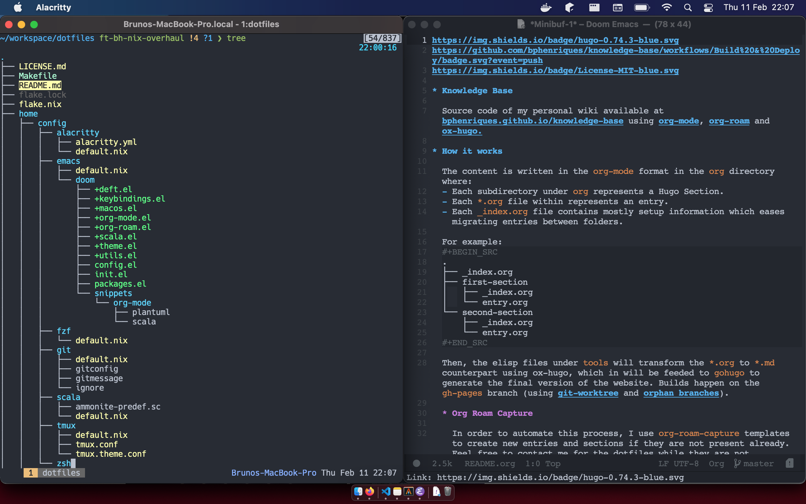

[](https://builtwithnix.org)

Hi! 👋 Welcome to my repository containing my [Nix](https://nixos.org/) configurations to manage my machines. A declarative and _more_ reproducible way to set working environments.

<p align="center">
    
</p>

----

# Pre-Requirements

1. Ensure `nix` is installed and sourced: https://nixos.org/manual/nix/stable/#chap-installation

   ```aidl
   test -f "$HOME"/.nix-profile/etc/profile.d/nix.sh && . "$HOME"/.nix-profile/etc/profile.d/nix.sh
   ```

# Setup

| Host | Operating System |
|-|-|
| [`personal-macos`](hosts/personal-macos.nix) | macOS |
| [`work-macos`](hosts/work-macos.nix) | macOS |
| [`ubuntu-vm`](hosts/ubuntu-vm.nix) | Ubuntu |

1. Run the bootstrap:
```sh
$ /bin/bash -c "$(curl -fsSL https://raw.githubusercontent.com/bphenriques/dotfiles/master/scripts/bootstrap.sh)"
```

2. Sync flake
```sh
$ cd "$HOME"/.dotfiles
$ make sync
```

3. Export your public and private keys and import them:
```sh
$ cat public.pgp  | pgp --import
$ cat private.pgp | pgp --import
```

**Warning**: Do not forget to delete the GPG keys.

4. Reboot!

# Updating

```sh
$ make update
```

This will update both `flake.lock` and Doom Emacs. Check if everything is stable before committing.

# Troubleshooting

#### 1. Fail to find `nix` nor any home-manager binary.

Make sure that you have the following in your `$ZDOTDIR/.zprofile` (here to ensure precedence):
```sh
# If nix can't be found
. /Users/$USER/.nix-profile/etc/profile.d/nix.sh

# If Home-Manager binaries can't be found
. /etc/profiles/per-user/$USER/etc/profile.d/hm-session-vars.sh
export PATH="/etc/profiles/per-user/$USER/bin:$PATH"
```

I suspect this is related with [this](https://github.com/LnL7/nix-darwin/pull/286).

#### 2. Fail to find `brew`.

Make sure that `/etc/zprofile` is calling `/usr/libexec/path_helper` as follows:
```sh
if [ -x /usr/libexec/path_helper ]; then
        eval `/usr/libexec/path_helper -s`
fi
```

You might need to create copy `/etc/zprofile.orig` to `/etc/zprofile`:
```sh
$ sudo cp /etc/zprofile.orig /etc/zprofile
```

Or if it does not work, add the following:
```sh
CPU=$(uname -p)
if [[ "$CPU" == "arm" ]]; then
    eval $(/opt/homebrew/bin/brew shellenv)
else
    eval $(/usr/local/bin/brew shellenv)
fi
```

#### 3. `zsh compinit: insecure directories, run compaudit for list.`

The mentioned directories are considered as they can be written by users that are not either the `root` or the current user ([source](http://zsh.sourceforge.net/Doc/Release/Completion-System.html##Use-of-compinit)). For this purpose, remove the rogue permissions:
```sh
compaudit | xargs chmod go-w
```

# Acknowledgments

[Nix](https://nixos.org/) can be overwhelming with its steep learning curve. I found it easier reading documentation and ~some~ several dotfiles:
- [Nix Docs](https://nixos.org/guides/nix-pills/)
- [Home Manager Docs](https://nix-community.github.io/home-manager)
- [Nix Darwin Docs](https://daiderd.com/nix-darwin/manual/index.html)
- [Flakes Docs](https://nixos.wiki/wiki/Flakes)
- [Flakes Introduction](https://www.tweag.io/blog/2020-05-25-flakes/).
- Several dotfiles:
    - [`hlissner`](https://github.com/hlissner/dotfiles)
    - [`malob`](https://github.com/malob/nixpkgs)
    - [`kclejeune`](https://github.com/kclejeune/system)
    - [`mitchellh`](https://github.com/mitchellh/nixos-config)
    - [`mjlbach`](https://github.com/mjlbach/nix-dotfiles)
    - [`sei40kr`](https://github.com/sei40kr/dotfiles)
    - [`samuelludwig`](https://github.com/samuelludwig/nixrc)
    - [`jacobfoard`](https://github.com/jacobfoard/dotfiles)

If you are new to dotfiles, I suggest looking for a more direct solution using a mixture of bare git repository and [`stow`](https://www.gnu.org/software/stow/) to symlink all the dotfiles. Start small and build up and make the tools work for you :)

Feel free to contact me if you need help!
