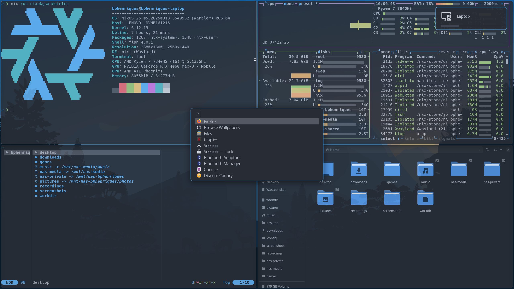
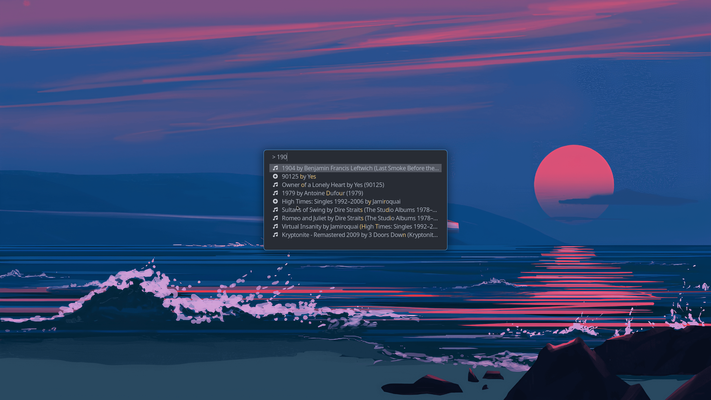

Hi! 👋 

This is my personal configuration using [nix](https://nixos.org/) that works _for me_. I hope this helps you!

I try to have a minimalist and keyboard oriented setup. Take a look around and ask me anything!

  
  
  <em>Commit <a href=https://github.com/bphenriques/dotfiles/commit/db9275579208f7d1b4a3ef24aa01a2ab3ece9df4><code>db9275579208f7d1b4a3ef24aa01a2ab3ece9df4</code></a></em>

Relevant Software:
- **Operating System**: [NixOS](https://nixos.org/)
- **Compositor**: [`niri`](https://github.com/YaLTeR/niri)
- **Launcher**: [`fuzzel`](https://codeberg.org/dnkl/fuzzel)
- **Terminal**: [`foot`](https://codeberg.org/dnkl/foot)
- **Notifications**: [`dunst`](https://github.com/dunst-project/dunst)
- **Shell**: [`fish`](https://github.com/fish-shell/fish-shell)
- **File Manager**: [Nautilus](https://gitlab.gnome.org/GNOME/nautilus) but moving to [Yazi](https://github.com/sxyazi/yazi) _slowly_
- **Editor**: [IntelliJ IDEA](https://www.jetbrains.com/idea/) but moving to [Helix](https://github.com/helix-editor/helix) _slowly_
- **Music**: [Music Player Daemon](https://www.musicpd.org/) with a custom wrapper around [`mpc`](https://www.musicpd.org/clients/mpc/)
- **Internet Browser**: [Firefox](https://www.mozilla.org/firefox/new/) but exploring alternatives
- **Quick Menu**: [`wlr-which-key`](https://github.com/MaxVerevkin/wlr-which-key)

For those interested in the Nix aspects of the project:
- [`disko`](https://github.com/nix-community/disko) for declarative disk partitioning
- [`stylix`](https://github.com/danth/stylix) for consistent theming in general
- [`nixos-anywhere`](https://github.com/nix-community/nixos-anywhere) to automate remote installations
- Not using [flake-utils](https://github.com/numtide/flake-utils) intentionally. I find it an _unnecessary_ abstraction
- Not using [impermanence](https://github.com/nix-community/impermanence). I tried and... it is _too much_
