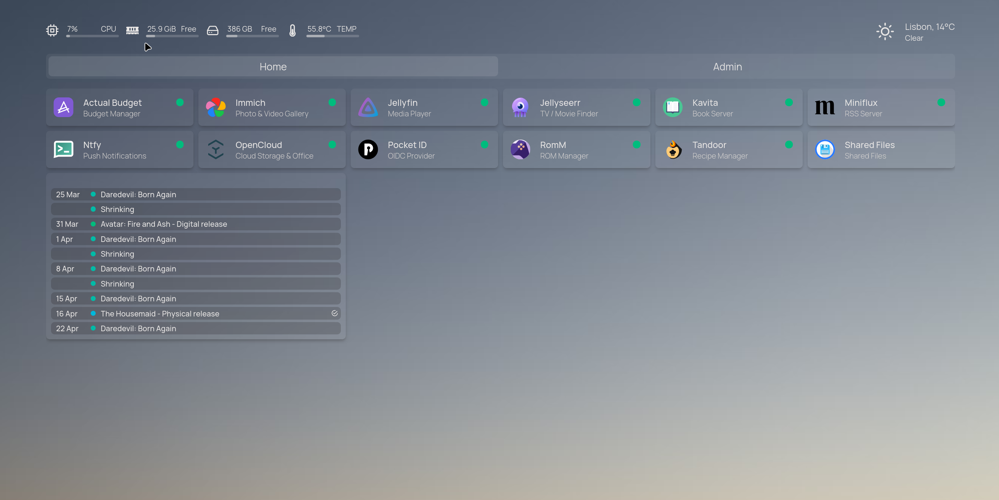
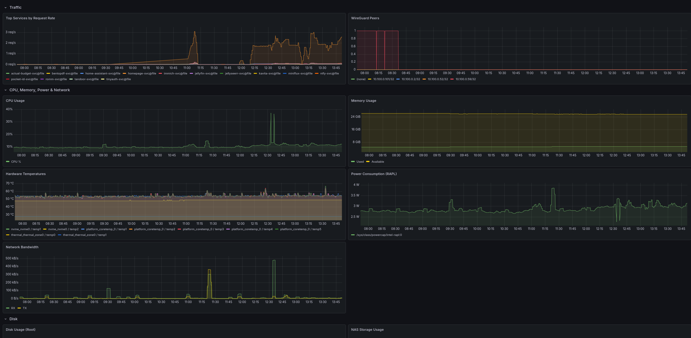
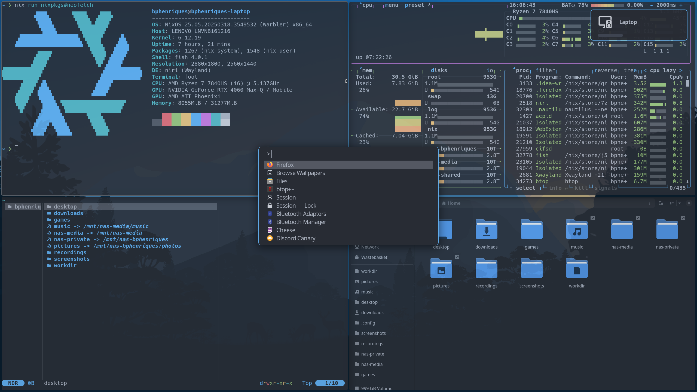
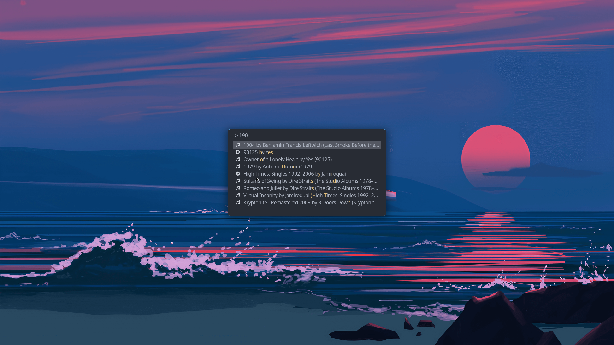

# bphenriques's fleet (Homelab & Laptops & Misc)

[](./modules)
[](./packages)
[](./apps/nixos-install/README.md)
[](./apps/darwin-install/README.md)

Hi! 👋 This is my personal [NixOS](https://nixos.org/) and [nix-darwin](https://github.com/LnL7/nix-darwin) flake that
works _for me_. I hope this helps you!

<p float="center">
  
  
</p>

<p float="center">
  
  
</p>

## Hosts

| Host                             | Platform | Description                                                                                            |
|----------------------------------|----------|--------------------------------------------------------------------------------------------------------|
| [compute](./hosts/compute)       | NixOS    | Self-hosted homelab ([service catalogue](./hosts/compute/services.md), OIDC SSO, secret provisioning). |
| [laptop](./hosts/laptop)         | NixOS    | Personal workstation                                                                                   |
| [inky](./hosts/inky)             | NixOS    | Raspberry Pi Zero 2W connected to Inky Impression and speakers                                         |
| [work-macos](./hosts/work-macos) | Darwin   | Work MacBook                                                                                           |

The [`compute`](./hosts/compute) host uses a [declarative service framework](./hosts/compute/README.md) where a single
registration drives ingress, OIDC, secrets, monitoring, homepage, and backups:

```nix
custom.homelab.services.miniflux = {
  metadata = { description = "RSS"; category = "General"; /* ... */ };
  port = 8081;
  oidc.enable = true;
  integrations.homepage.enable = true;
  healthcheck.path = "/healthcheck";
  backup.package = /* pre-backup hook script */;
};
```

## Nix Stack

Layout:

- [`hosts/`](./hosts): per-host configurations (hardware, services, users)
- [`modules/`](./modules): reusable modules that *define* options (e.g., `custom.homelab.*`)
- [`profiles/`](./profiles): shared opinionated configuration that *sets* standard options (imported by hosts)
- [`packages/`](./packages): custom packages and scripts
- [`lib/`](./lib): custom helpers and builders
- [`apps/`](./apps): runnable scripts (installation, post-install)

Key dependencies:

- [`disko`](https://github.com/nix-community/disko) for declarative disk partitioning
- [`stylix`](https://github.com/danth/stylix) for consistent theming
- [`sops-nix`](https://github.com/Mic92/sops-nix) for secrets
- [`nixos-anywhere`](https://github.com/nix-community/nixos-anywhere) for remote installations

Not using [flake-utils](https://github.com/numtide/flake-utils)
or [impermanence](https://github.com/nix-community/impermanence) intentionally.

## Sensitive Configuration

I use a companion private `dotfiles-private` repository as a flake input for private configuration mapped to
`self.private` because:

- I do not want to expose private information such as public domain, user definitions, and SMTP settings.
- I do not want to overexpose the sops encrypted file nor the `.sops.yaml`.

<details>
<summary>Structure of <code>dotfiles-private</code></summary>

```
.
├── flake.lock
├── flake.nix
├── hosts
│   ├── compute
│   │   ├── default.nix
│   │   ├── secrets.yaml    <- Encrypted
│   │   ├── settings.nix
│   │   └── users
│   │       ├── bphenriques.nix
│   │       └── johndoe.nix
│   └── laptop
│       ├── default.nix
│       └── secrets.yaml    <- Encrypted
├── packages
│   └── wallpapers
│       ├── default.nix
│       └── src
│           ├── beach-night-sky.jpg
│           ├── ...
│           └── watch-tower.png
├── README.md
└── shell.nix               <- With sops package inside
```

</details>

## Workflow

A [`dot`](./packages/dotfiles/dotfiles) CLI wraps the native rebuild tools:

```bash
dot . s              # apply changes to the current host
dot . u              # update flake inputs
dot . c              # show changelog between last two local profiles
dot compute s        # deploy to the compute host remotely
dot compute c        # show changelog for the compute host
```

## AI Disclaimer

AI was used from January 2026 onwards, starting with the [`compute`](./hosts/compute) host to learn and iterate faster,
not to replace understanding. I drive the architecture, review and own every line.

## Acknowledgements

Thanks to everyone sharing dotfiles, maintaining the [Arch Wiki](https://wiki.archlinux.org/)
and [NixOS Wiki](https://wiki.nixos.org/), and helping in
the [NixOS community](https://github.com/NixOS/nixpkgs?tab=readme-ov-file#community).
