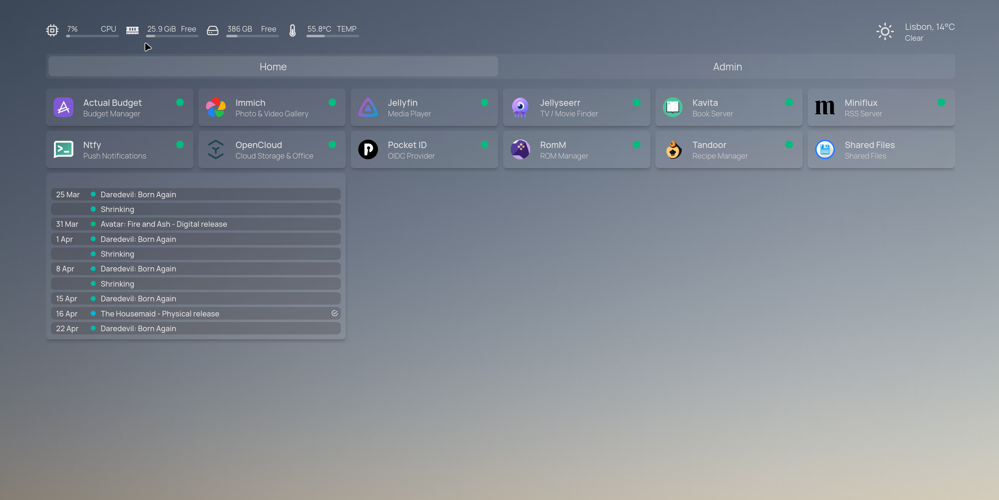
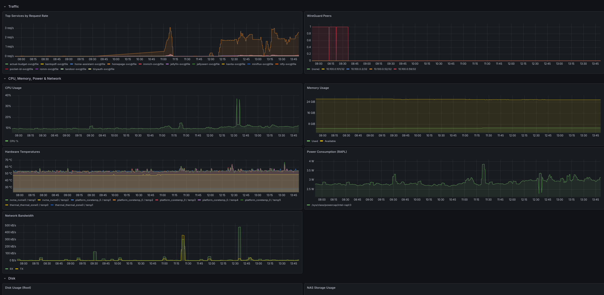

# Compute Server

NixOS selfhost server built using my **[`selfhost-nix`](https://github.com/bphenriques/selfhost-nix)** flake.

<p float="center">
  
  
</p>

## Hardware

- **Model**: Beelink EQ14
- **CPU**: Intel N150 (4 E-cores, shared CPU/iGPU die)
- **RAM**: 32GB

Made some tweaks to ensure thermal stability with sustained workloads:

- **BIOS fan curve** (`Del` → `Advanced → Hardware Monitor → Smart Fan Function`): adjust to run fans at full-speed at **80°C** (default is 90°C) and to start earlier with slope of 4 PWM/°C. Temperatures dropped from 83°C to ~65°C under identical load.
- **Systemd `throttled.slice`**: heavy services (Immich, Jellyfin) pinned to cores 1-2 (`AllowedCPUs`), hard-capped (`CPUQuota=150%`).
- **Systemd `critical.slice`**: SSH/DHCP.

## Architecture

```
  Cloudflare           ┌──────────────────────────────────────────┐
  (DNS + ACME only)    │            Compute Server                │
                       │                                          │
  LAN / Wireguard ─────├──▶ Traefik ──┬──▶ Pocket-ID (OIDC)       │
                       │              ├──▶ Tinyauth (ForwardAuth) │
                       │              ├──▶ Homepage               │
                       │              ├──▶ Jellyfin, Immich, ...  │
                       │              │                           │
                       │  Prometheus ─┼──▶ scrape targets         │
                       │       │      │                           │
                       │       ▼      │                           │
                       │  Alertmanager──▶ ntfy ──▶ push notif     │
                       │                                          │
                       │  sealed microVMs on an internal bridge:  │
                       │    cv-vm    → Cloudflare Tunnel (public) │
                       │    agent-vm → ai host Ollama (private)    │
                       │                                          │
                       │  rustic (cron) ──────────────────────────├──▶ Backblaze B2
                       └──────────────┬───────────────────────────┘    (off-site)
                                      │
                                      ▼
                                ┌───────────┐
                                │    NAS    │
                                │ (Storage)│
                                └───────────┘
                                  SMB mounts
```

## Access Control

| Group    | Target                      | Example access       |
| -------- | --------------------------- | -------------------- |
| `admin`  | Homelab owner               | Everything           |
| `users`  | Household                   | Media, recipes       |
| `guests` | Family and friends, invited | Immich, Kavita, RomM |

`admin` and `users` are declared in `dotfiles-private/users`. `guests` are not declared anywhere:
membership lives in Pocket-ID, so inviting someone is the whole grant and needs no deploy. The tier is
indivisible, since a service either lists `guests` or it does not.

Groups only bind services that authenticate through Pocket-ID. Homepage, cook-recipes and BentoPDF ask
for nothing, so anyone on the tunnel reaches them whatever their group.

RomM runs in kiosk mode: it is readable without logging in, and only `admin` can modify the library.

## Onboarding a guest

Two grants, both runtime. Neither needs a commit or a deploy.

1. **Network**, on compute: `sudo wg-manage add <name>` mints the keypair, brings the peer up, and
   renders the config as a QR to scan. `--conf` prints the config instead, for someone you cannot hand
   a screen to, which means sending a live credential: fine for the restricted tier, never for
   `--full-access`.
2. **Identity**, once they are connected: `sudo pocket-id-manage guest invite <email> --firstName <name>`
   creates the account in the `guests` group and emails a one-time link. Without SMTP, create the user
   in the Pocket-ID admin UI and mint the link with `pocket-id one-time-access-token <username>`. It
   signs them in once; they register a passkey from there.

Their Immich account appears on first login, at the quota in `selfhost/services/immich.nix`. Raise it
per person in the Immich admin UI; it is set at creation and never reconciled, so the change sticks.
Uploads land under their Pocket-ID username rather than a UUID.

Offboarding is `pocket-id-manage guest remove <username>` plus `wg-manage remove <name>`. The first
refuses anyone outside the `guests` group, so it cannot touch a household account. Deleting the
Pocket-ID account ends access; the Immich data outlives it and is removed in the Immich admin UI.

A device's tier is its address: `10.100.0.0/28` reaches the LAN, every other address in the tunnel
reaches Traefik on 80 and 443 and nothing else. The firewall matches the prefix, so an address is
bounded by where it sits rather than by any list being correct.

Peers are runtime state in `/var/lib/wireguard/peers.json`, applied live.

A config cannot be shown again: the private key is minted in memory and never stored, so replacing a
lost one is `wg-manage remove <name>` then `add`, which issues a new key.

`wg-manage status` is the inventory and `remove <name>` cuts a peer. `wireguard-apply-peers` restores
the file whenever the interface appears; `wg-manage apply` re-syncs it after a hand edit, which is the
escape hatch for anything the three commands do not cover.

Backups carry the peer file, not the server private key. Losing the host therefore costs every device
one edited field (the peer's `PublicKey`), which the restored file is what makes possible: it still
holds who had which address and which key.

## Setup

| Dependency   | What                                                   | Reference                                                  |
| ------------ | ------------------------------------------------------ | ---------------------------------------------------------- |
| SMB Server   | Access to a SMB server                                 | [storage](../storage/README.md)                            |
| Cloudflare   | DNS zone + API token (DNS-01 ACME challenge)           | [infrastructure](../../infra/README.md)                    |
| SMTP         | Account credentials for transactional email            |                                                            |
| Backblaze B2 | Bucket + application key for off-site backups          |                                                            |
| ZBT-2 Dongle | Nabu Casa Connect ZBT-2 (Thread/Matter radio)          | Flash OpenThread RCP firmware post-install                 |
| Secrets      | Bootstrap via `dotfiles-secrets init-host` (Bitwarden) | [`apps/nixos-install`](../../apps/nixos-install/README.md) |

Run [`apps/nixos-install`](../../apps/nixos-install/README.md): disko partitioning, secrets provisioning, NixOS install.

## Post-Install

Steps not worth automating: unstable APIs, wizard-driven, or tolerable one-time.

### Pocket-ID

Register admin passkey via browser (accept the invite received via email)

### Home Assistant

1. Complete onboarding wizard
2. Flash ZBT-2 with OpenThread RCP firmware using [Device Toolbox](https://toolbox.openhomefoundation.org/home-assistant-connect-zbt-2/) from a PC with Chrome
3. Add OTBR integration: Settings → Integrations → OTBR → `http://127.0.0.1:8091`
4. Add Thread integration: set OTBR network as preferred, enable Android/iOS credentials
5. Add Matter integration: accept default websocket URL
6. Sync Thread credentials in companion app, then commission Matter devices by scanning QR codes
7. Configure backup scheduler (UI): write backups to `/var/lib/hass/backups/` for off-site pickup

### Kapowarr

1. Set ComicVine API key: Settings → General → ComicVine API Key (get one at [comicvine.gamespot.com](https://comicvine.gamespot.com/api/))
2. Add root folder: Settings → Media Management → Root Folders → add `/comics`
3. Torrent client: only qBittorrent is supported (Transmission planned for V1.4.0); built-in direct download clients (GetComics, Mega, Pixeldrain) work without configuration

### Jellyfin

Configure Open Subtitles plugin credentials: Admin → Plugins → Open Subtitles → API key

### Seerr

Trigger initial library scan

### Sonarr / Radarr / Prowlarr

Enable extension protection per indexer (UI): Settings → Indexers → edit each indexer → Advanced → Fail Downloads → enable Dangerous Extensions and Executable Extensions

### Obsidian LiveSync

Same steps on desktop, Android and iOS. The URI carries the CouchDB credentials and the vault
passphrase: it prints once, is never stored, and should be treated as a secret.

Mint one, either way:

- From a device already syncing: LiveSync settings → Quick Setup → copy the URI, or show its QR
  code. Easiest onto a phone.
- From the server: `ssh root@compute livesync-setup-uri`. Takes a passphrase as the first argument,
  otherwise it generates one and prints it alongside.

On the new device:

1. Create an **empty** vault. On phones keep it on the device, not iCloud or Drive, or it fights
   with LiveSync over the same files.
2. Install Self-hosted LiveSync from Community plugins. Plugins are not synced, so this is per device.
3. Open the URI or scan the QR, then enter the passphrase.
4. Welcome notice: `I am adding a device to an existing synchronisation setup` → `Use a Setup URI`
   → `Restart and Fetch Data` → `Overwrite all with remote files` → `Keep local files even if not on remote`.
5. Set Sync Mode to **LiveSync**. On Events misses remote changes.

`couchdb.<domain>` points at a LAN address, so the device needs the LAN or WireGuard. Phones sync
only while Obsidian is open: background replication is desktop-only.

### Syncthing

Accept device connections: approve pending devices on first sync

### Radicale

Share CalDAV/CardDAV URL with clients: `dav.<domain>` with generated `htpasswd` credentials

### WireGuard

Own devices take `--full-access`, which allocates from `10.100.0.0/28`. Thirteen addresses, and
`wg-manage` errors rather than spilling out of the block.
